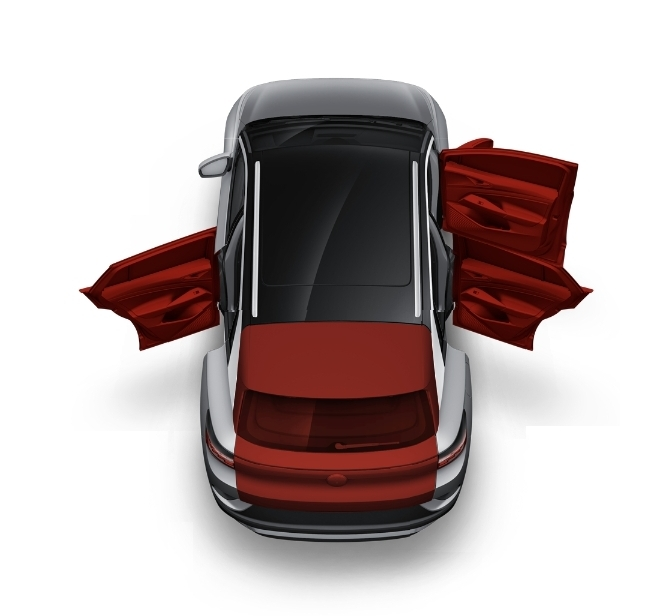

# ID.4-Home-Assistant-Door-Trunk-status
I forgot to close one of the car doors when bringing home the kids, I did remember to lock the car though..
When I received notifications that the car might not be properly locked, I saw that the VW Connect app display images of the door status.
So I decided to smash together (with the help of Gemini to speed up things) some sloppy edited screenshots from the app (as I did not want to bother to open the doors in all combinations) and show the door status on my Home Assistant wall panel in addition to a notification of open doors.

Probably totally unecessary and overkill. but fun.

Hashtag: Stressed dad.

Images copied and modified from Volkswagen app. 
Sensors received from the https://github.com/robinostlund/homeassistant-volkswagencarnet integration.

| State Index (Integer) | Binary Representation (LF-RF-LB-RB-T) | Doors/Trunk that are OPEN ('off')                            | Image Filename |
| --------------------- | ------------------------------------- | ------------------------------------------------------------ | -------------- |
| 0                     | 0                                     | All Doors/Trunk CLOSED (Default)                             | image_0.jpg    |
| 1                     | 1                                     | Trunk                                                        | image_1.jpg    |
| 2                     | 10                                    | Right Back Door                                              | image_2.jpg    |
| 3                     | 11                                    | Right Back Door + Trunk                                      | image_3.jpg    |
| 4                     | 100                                   | Left Back Door                                               | image_4.jpg    |
| 5                     | 101                                   | Left Back Door + Trunk                                       | image_5.jpg    |
| 6                     | 110                                   | Left Back Door + Right Back Door                             | image_6.jpg    |
| 7                     | 111                                   | Left Back Door + Right Back Door + Trunk                     | image_7.jpg    |
| 8                     | 1000                                  | Right Front Door                                             | image_8.jpg    |
| 9                     | 1001                                  | Right Front Door + Trunk                                     | image_9.jpg    |
| 10                    | 1010                                  | Right Front Door + Right Back Door                           | image_10.jpg   |
| 11                    | 1011                                  | Right Front Door + Right Back Door + Trunk                   | image_11.jpg   |
| 12                    | 1100                                  | Right Front Door + Left Back Door                            | image_12.jpg   |
| 13                    | 1101                                  | Right Front Door + Left Back Door + Trunk                    | image_13.jpg   |
| 14                    | 1110                                  | Right Front Door + Left Back Door + Right Back Door          | image_14.jpg   |
| 15                    | 1111                                  | Right Side Open (RF, RB, LB, T)                              | image_15.jpg   |
| 16                    | 10000                                 | Left Front Door                                              | image_16.jpg   |
| 17                    | 10001                                 | Left Front Door + Trunk                                      | image_17.jpg   |
| 18                    | 10010                                 | Left Front Door + Right Back Door                            | image_18.jpg   |
| 19                    | 10011                                 | Left Front Door + Right Back Door + Trunk                    | image_19.jpg   |
| 20                    | 10100                                 | Left Front Door + Left Back Door                             | image_20.jpg   |
| 21                    | 10101                                 | Left Front Door + Left Back Door + Trunk                     | image_21.jpg   |
| 22                    | 10110                                 | Left Front Door + Left Back Door + Right Back Door           | image_22.jpg   |
| 23                    | 10111                                 | Left Front Door + Left Back Door + Right Back Door + Trunk   | image_23.jpg   |
| 24                    | 11000                                 | Left Front Door + Right Front Door                           | image_24.jpg   |
| 25                    | 11001                                 | Left Front Door + Right Front Door + Trunk                   | image_25.jpg   |
| 26                    | 11010                                 | Left Front Door + Right Front Door + Right Back Door         | image_26.jpg   |
| 27                    | 11011                                 | Left Front Door + Right Front Door + Right Back Door + Trunk | image_27.jpg   |
| 28                    | 11100                                 | Left Front Door + Right Front Door + Left Back Door          | image_28.jpg   |
| 29                    | 11101                                 | Left Front Door + Right Front Door + Left Back Door + Trunk  | image_29.jpg   |
| 30                    | 11110                                 | All Doors Open (LF, RF, LB, RB)                              | image_30.jpg   |
| 31                    | 11111                                 | All Doors/Trunk OPEN                                         | image_31.jpg   |
